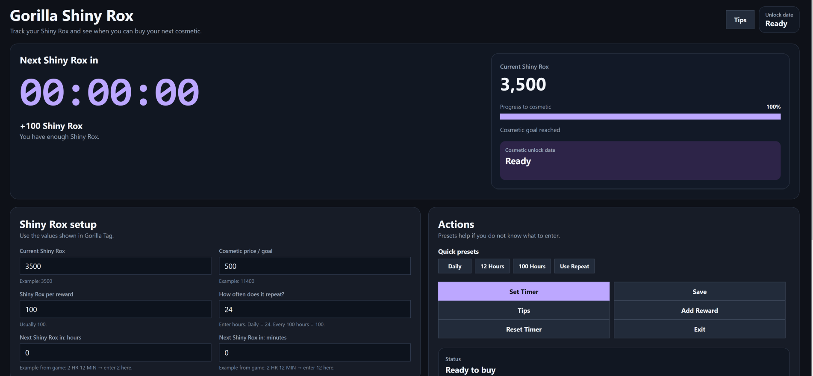

# Gorilla Shiny Rox

**Gorilla Shiny Rox** is an unofficial fan-made Shiny Rox tracker for Gorilla Tag.

It helps players track their current Shiny Rox, enter the real in-game reward timer, and estimate when they can afford a cosmetic.

## Screenshot



## Features

* Track your current Shiny Rox
* Enter the in-game Shiny Rox countdown timer
* Estimate when you can afford a cosmetic
* Load current cosmetic names and prices when available
* Supports normal Shiny Rox prices
* Supports Free cosmetics
* Supports Price Unknown items
* Creator badges are marked as not buyable
* Manual price entry fallback
* Starts at `00:00:00` until the user enters the real timer

## How to Use

1. Open Gorilla Tag.
2. Check your current Shiny Rocks.
3. Check how long until your next Shiny Rocks reward.
4. Open Gorilla Shiny Rox.
5. Enter your current Shiny Rox.
6. Enter the next reward timer from the game.
7. Enter or select a cosmetic price.
8. Click **Set Timer**.
9. The app will estimate when you can afford the cosmetic.

Example:

```text
Current Shiny Rox: 8500
Next Shiny Rox in: 2 HR 12 MIN
Goal cosmetic price: 11400
```

## Creator Badges

Some badges are not normal shop cosmetics.

Examples:

* AA Creator Badge
* Finger Painter Badge
* Illustrator Badge

These are marked as creator-only and cannot be bought with Shiny Rox.

To apply for the Another Axiom creator program, visit:

https://www.anotheraxiom.com/aa-creator

## Safety & Privacy

Gorilla Shiny Rox is an open-source fan-made utility app.

The app does **not** collect personal information, does **not** ask for your Gorilla Tag login, and does **not** connect to your Gorilla Tag account.

The app only uses the numbers you type in manually, such as your current Shiny Rox amount, cosmetic goal price, and the in-game countdown timer.

If Windows shows a warning, it may be because this is a small beta app from an independent developer and the `.exe` is not code-signed yet. That does not automatically mean the app is unsafe.

For safety, you can:

* Review the source code in this repository
* Build the app yourself in Visual Studio
* Scan the download with Windows Security or VirusTotal
* Only download the app from the official GitHub Releases page

Never download random reuploads from other websites.

## Known Limitations

* Cosmetic images are not included in this beta for stability.
* Cosmetic prices may be incomplete or outdated.
* Always check the in-game shop before buying.
* The app does not connect to Gorilla Tag automatically.
* The user must enter their Shiny Rox and timer manually.
* Windows may show a warning because this beta is not code-signed yet.

## Disclaimer

This is an unofficial fan-made tool.

Gorilla Shiny Rox is not affiliated with Gorilla Tag, Another Axiom, Meta, or any official Gorilla Tag team.

All names, references, and related content belong to their respective owners.

## Version

```text
v0.1 Beta
```

This is an early public beta. Bugs and missing cosmetic data may happen.

## License

MIT License
